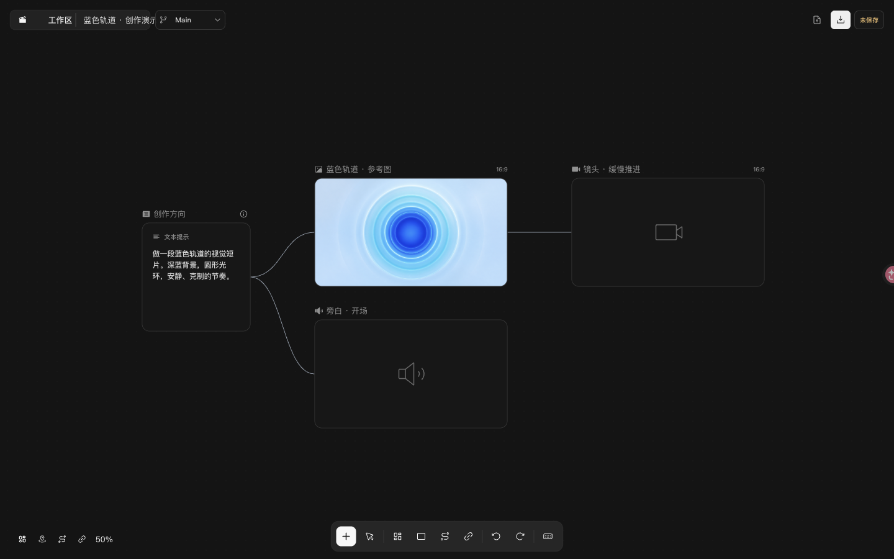
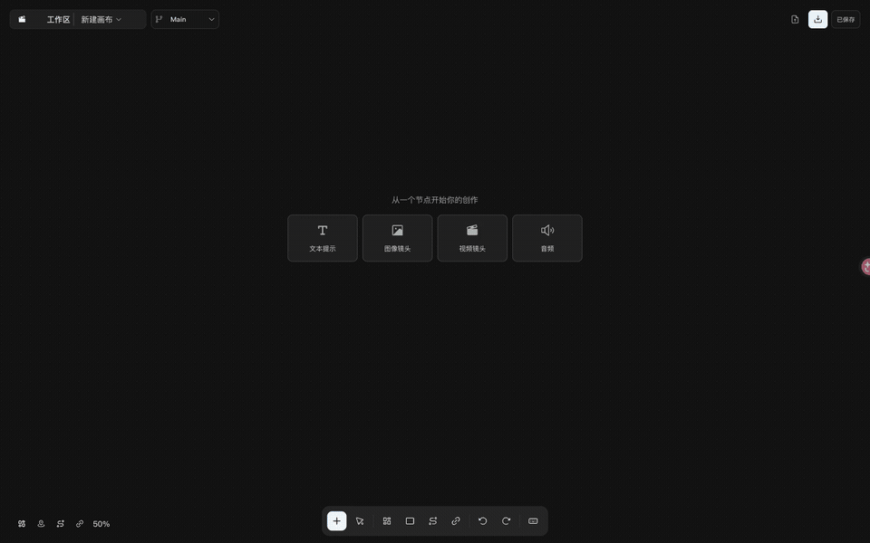
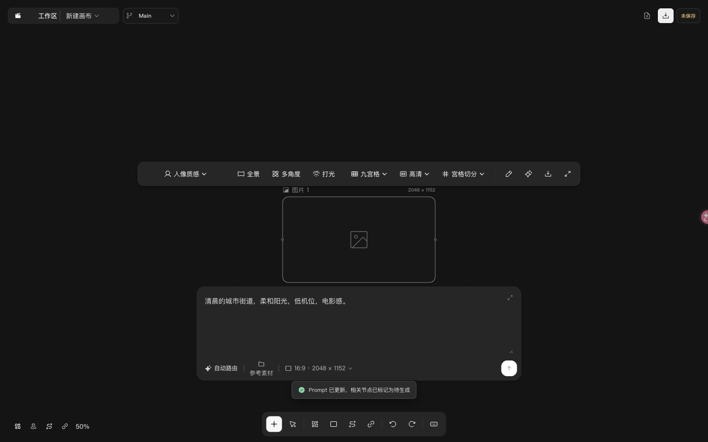
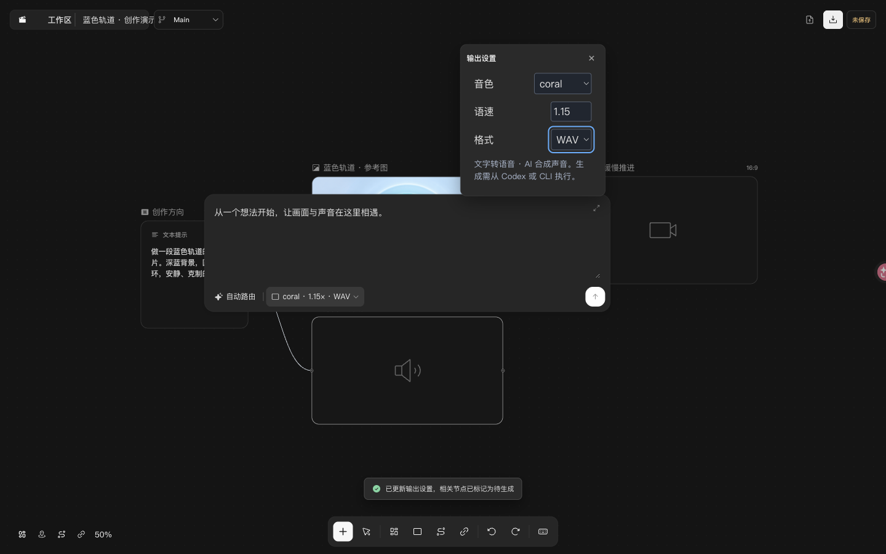
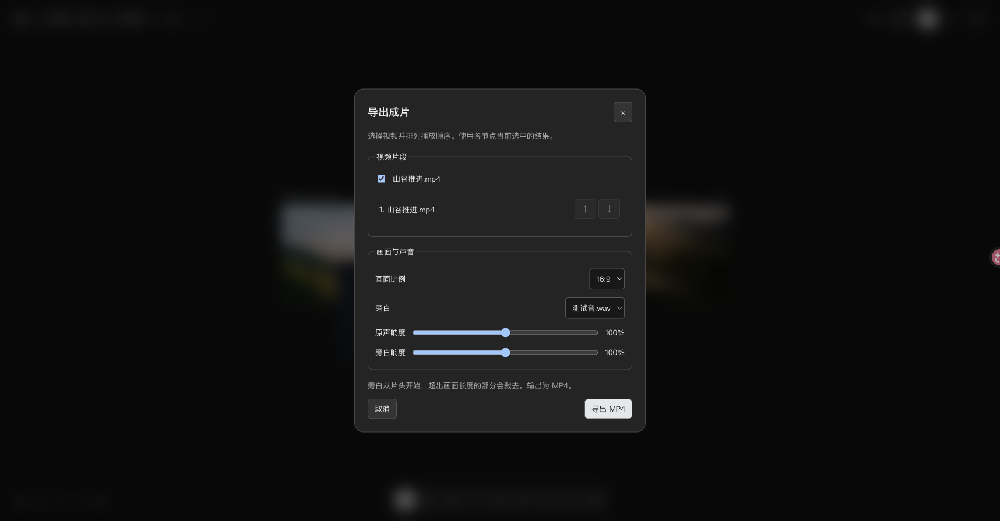

# Open Canvas

用自然语言创建和修改本地 AI 创作画布。通过 Codex Skill 描述想要的内容，CLI 执行节点操作与媒体生成，Studio 展示可编辑的无限画布。

[npm 安装包](https://www.npmjs.com/package/open-canvas-cli) · [CLI 使用说明](packages/cli/README.md) · [Codex Skill](skills/open-canvas/SKILL.md) · [Studio 使用说明](packages/preview/README.md)

- **对话创作**：增加节点、修改提示词、连接参考素材或创建草稿，按当前请求逐步编辑。
- **本地项目**：CLI、Skill 和 Studio 共用项目文档，素材与结果历史保存在项目中。
- **四类节点**：文本、图片、视频、音频，支持拖入素材、预览、生成、结果历史和成片导出。
- **自带密钥（BYOK）**：真实生成使用用户配置的提供方；创建和编辑画布无需 API key。

CLI 安装包包含 Studio 和 Codex Skill。`open-canvas init ./my-canvas --title "我的画布" --open` 创建本地项目并打开画布，无需克隆源码或启动开发服务。

## 先看它能做什么

例如，你想做一段视觉短片：在 Codex 中说“增加一个图片节点，先不要生成”，再说“把它改成清晨”。Open Canvas 会把这些要求落实为可编辑的画布节点。你也可以在 Studio 中直接改提示词，把文字方向、参考图、视频镜头和旁白放在一起，用连线组织它们的上下文关系。



图中是“蓝色轨道”示例项目：图片为导入的仓库测试素材，视频和旁白尚未生成。连线表达节点依赖；导出成片时，另行选择已完成的视频、排列顺序并添加旁白。

### 操作演示

[](docs/qa/readme-demo/studio-walkthrough.mp4)

[观看或下载清晰版操作视频（MP4）](docs/qa/readme-demo/studio-walkthrough.mp4) · [演示素材与复现说明](docs/qa/readme-demo/README.md)

录屏展示当前 Studio 的实际操作，无需 API key：

1. 从空画布的“添加节点”菜单新建图片节点。
2. 输入雨夜街道的提示词，点击“应用提示词”；随后改成清晨，再次应用。
3. 打开准备好的四类节点示例，查看文本、图片、视频与音频的关系。
4. 选中旁白节点，打开输出设置，调整语速。

**编辑节点不会自动生成媒体。** 需要出图、生成视频或朗读旁白时，明确让 Codex 生成，或在本地 Studio 的节点编辑器中点击“生成”，由 CLI 调用你配置的提供方。

| 直接修改画面要求 | 设置旁白参数 |
| --- | --- |
|  |  |

想用自然语言操作，从下面的安装步骤开始，再看“通过 Codex Skill 使用”；想直接操作画布，可跳到“启动 Studio”。

## 一、安装与快速开始

需要 **Node.js 22.16 或更高版本**和 npm。

```sh
npm install -g open-canvas-cli --registry=https://registry.npmjs.org/
open-canvas --version
open-canvas --help
```

npm 包名是 `open-canvas-cli`，安装后的命令是 `open-canvas`。在选定目录中创建空项目：

```sh
open-canvas init ./my-canvas --title "我的画布" --open
open-canvas context --project ./my-canvas
```

CLI 输出 JSON，便于查看项目、草稿和节点 ID，也便于脚本或智能体调用。创建项目后，可以通过下面的 Codex Skill 或 CLI 继续编辑。

只想查看命令、暂不全局安装时：

```sh
npm exec --yes --registry=https://registry.npmjs.org/ --package=open-canvas-cli -- open-canvas --help
```

## 二、通过 Codex Skill 使用

全局安装 CLI 后执行：

```sh
open-canvas skill install
```

默认安装目录是 `${CODEX_HOME:-$HOME/.codex}/skills/open-canvas`。自定义目录可用 `open-canvas skill install --dir /absolute/path/to/skills`。

在 Codex 新任务中提供项目路径并调用 `$open-canvas`，例如：

```text
用 $open-canvas 编辑 ./my-canvas：增加一个雨夜城市的图片节点，先不要生成。
```

之后可以继续说：

- “把这个图片节点改成清晨。”
- “增加一个音频节点，用这段文字生成旁白。”
- “保留当前草稿，再做一版竖屏方案。”

Skill 通过同一套 CLI 修改项目。创建或编辑节点不会自动发起模型请求；只有明确要求生成时，才执行配置的提供方调用。

重复安装相同 Skill 不会修改文件。已有内容不同时，安装器会保留原文件并报错；更新前请备份并移走旧目录。源码开发者也可以把仓库中的 `skills/open-canvas` 链接到本地技能目录。

## 三、直接使用 CLI

在已有项目中增加一个图片节点，不调用生成接口：

```sh
open-canvas node add --project ./my-canvas --kind shot --media-kind image --title "雨夜城市" --prompt "雨夜的城市街道，路面倒映灯光"
open-canvas context --project ./my-canvas
```

从返回的 JSON 中取得 `nodeId`，替换下面的 `<node-id>`，只修改这个节点：

```sh
open-canvas node update --project ./my-canvas --node <node-id> --prompt "清晨的城市街道，柔和的阳光"
```

### 3.1 无需 API key 的本地试用

以下示例创建一个独立项目，并在节点上显式设置 mock 提供方：

```sh
open-canvas init ./mock-demo --title "本地试用"
open-canvas node add --project ./mock-demo --kind shot --media-kind audio --title "旁白测试" --prompt "你好，欢迎来到我的故事。" --provider mock
```

用返回的 `nodeId` 替换 `<node-id>`，再执行：

```sh
open-canvas generate --project ./mock-demo --node <node-id>
open-canvas context --project ./mock-demo --node <node-id>
```

mock 生成确定性占位素材；音频是一秒静音，不是合成语音，也不需要远端 API。`--provider` 和 `--model` 在 `node add/update` 时设置，`generate` 使用节点已保存的路由，不接受这两个参数。

素材导入、历史结果选择和导出命令见 [四类节点使用说明](docs/four-node-usage.md)。

## 四、启动 Studio

安装 CLI 后，用一条命令打开已有本地项目：

```sh
open-canvas open --project /absolute/path/to/my-canvas
```

`open` 在回环地址的空闲端口启动 Studio 和单项目服务，并自动打开浏览器。只获取链接可添加 `--no-open`。源码开发时仍可通过 `--url` 连接另行启动的 Vite 服务。

在 Studio 中点击“保存本地项目”写回磁盘。CLI 更新项目后，Studio 在没有未保存编辑时自动加载新版本；存在未保存编辑时，会保留当前内容并提示处理外部更新。

将图片、视频或音频拖入画布即可创建带素材的节点，也可以在节点编辑器点击“导入”追加结果。“项目”菜单提供：

- **导出完整项目**：下载 `.ocanvas` 项目包，包含项目文档和媒体字节。通过“打开”选择项目包，会在原项目旁恢复到新目录。
- **导出成片**：勾选视频、调整顺序、选择旁白和音量，输出 MP4。使用各节点当前选中的历史结果；旁白从片头开始，超出画面长度的部分裁去。

“导出 JSON”只下载文档。单个素材导入上限 256 MiB；项目包媒体总量上限 4 GiB，浏览器恢复的压缩包上限 1 GiB。更大的包可使用 CLI 恢复。桥接链接含本地访问令牌，不应公开分享。更多操作见 [Studio 使用说明](packages/preview/README.md)。

相同操作也可从 CLI 执行：

```sh
open-canvas media import --project ./my-canvas --file ./clip.mp4
open-canvas project pack --project ./my-canvas --output ./my-canvas.ocanvas
open-canvas project unpack --file ./my-canvas.ocanvas --project ./restored-canvas --open
open-canvas render --project ./my-canvas --nodes <video-id-1>,<video-id-2> --audio <audio-id> --output ./film.mp4
```

成片输出为 H.264/AAC MP4，支持横屏、竖屏和方形画面，自动保留比例并补边。安装包通过平台依赖提供 FFmpeg/FFprobe；自备工具可设置 `OPEN_CANVAS_FFMPEG` 和 `OPEN_CANVAS_FFPROBE`。



[安装包、真实生成、项目恢复与成片验收记录](docs/qa/studio-p0-2026-09-30/README.md)

## 五、当前能力

| 节点 | 能力 |
| --- | --- |
| 文本 | 编辑正文或提示词，为下游媒体节点提供文本上下文 |
| 图片 | 图片生成、本地导入、预览、输出参数设置 |
| 视频 | 视频生成、本地导入、播放、输出参数设置 |
| 音频 | 文字转语音（TTS）、本地导入、播放、音色/语速/格式设置 |

媒体节点支持多次生成、历史结果选择和单节点导出。参考素材、可复用创作方向和结果历史属于当前项目。

当前不包含独立 LLM 聊天节点、音乐生成、声音克隆、完整时间线剪辑或全局素材库。旧项目中的脚本、角色、分析、剪辑等节点可以继续读取和编辑，新建菜单只提供上述四类节点。

## 六、配置真实生成

真实生成需要用户在本地环境中配置提供方凭证。密钥不应写入项目 JSON、provider 配置文件、源码或聊天。

| Adapter ID | 适配能力 | 默认凭证环境变量 |
| --- | --- | --- |
| `volcengine-ark` | 火山引擎 Ark 图片、视频生成 | `ARK_API_KEY` |
| `openai` | 图片生成与参考图输入 | `OPENAI_API_KEY` |
| `google-gemini` | 视频生成与参考图输入 | `GEMINI_API_KEY` |
| `openai-speech` | TTS，输出 WAV 或 MP3 | `OPENAI_API_KEY` |

配置好环境变量后，查看 CLI 的安全配置和凭证可用状态：

```sh
open-canvas provider list --env-file /absolute/path/to/private.env
```

`provider list` 不显示密钥，也不验证远端账户权限或模型可用性。未指定路由的节点在执行 `generate` 时自动选择符合要求的已配置真实提供方，可能产生费用；没有可用路由时失败，不会回退到 mock。

自定义提供方实例使用 `--provider-config <path>` 或 `OPEN_CANVAS_PROVIDER_CONFIG`。配置只记录实例 ID、adapter、模型 ID、优先级和凭证环境变量名等安全信息。Ark 实例可通过 `baseUrl` 指定 HTTPS API 根地址；该地址不会写入画布。详见 [Provider 契约](docs/provider-contract.md)。

用 `open-canvas open --project ./my-canvas --env-file /absolute/path/to/private.env --provider-config /absolute/path/to/providers.json` 启动可生成的本地 Studio。凭证只进入本地服务进程，浏览器不读取密钥。“应用提示词”只修改文档，“生成”先保存编辑再显式发起请求。

视频轮询中断后，点击“继续查询”或再次执行相同节点的 `generate` 会查询原任务。若请求已发出但尚未收到任务 ID，恢复时会报告完成状态未知，不会自动重复提交。TTS 是同步接口，中断后也需要检查原请求再明确发起新尝试。

## 七、开发与验证

| 目录 | 职责 |
| --- | --- |
| `packages/core` | 项目 schema、共享操作、校验、任务状态和提供方适配 |
| `packages/cli` | 项目持久化、生成执行、Skill 安装和本地预览桥接 |
| `packages/preview` | React Flow Studio |
| `skills/open-canvas` | 随 CLI 分发的 Codex Skill 源文件 |
| `docs/schema` | 权威项目 schema，Core 构建时生成对应代码 |

在仓库根目录执行：

```sh
npm run check
npm test
npm run build
npm run test:package
git diff --check
```

本地打包可运行 `npm run pack:cli`，产物位于 `artifacts/open-canvas-cli-<version>.tgz`。

### 7.1 GitHub CI 与 npm 自动发布

PR 和 `main` 提交会触发 [CI](https://github.com/tracyxiong1/open-canvas/actions/workflows/ci.yml)，在 Node.js 22.16 和 24 上执行类型检查、源码测试、全量构建和独立安装包验证。通过验证的 npm tarball 保存在该次运行的 Artifacts 中。

发布沿用 [md-review-server](https://github.com/tracyxiong1/md-review-server) 的 Release Please 流程：

1. 使用 `fix:`、`feat:` 等 Conventional Commits 合并改动到 `main`。
2. [Release Please](https://github.com/tracyxiong1/open-canvas/actions/workflows/release-please.yml) 自动创建或更新版本 PR，同步版本号、锁文件和 CHANGELOG。
3. 合并版本 PR 后，自动创建 `vX.Y.Z` 标签和 GitHub Release，重新验证并发布 `open-canvas-cli`。

发布使用 npm Trusted Publishing（GitHub OIDC），不需要 `NPM_TOKEN`。npm 可信发布者绑定仓库 `tracyxiong1/open-canvas` 和工作流 `release-please.yml`；修改仓库或工作流文件名时，需要同步 npm 设置。构建、验证与发布使用同一个 tarball，并附带来源证明（provenance）。

版本覆盖整个仓库，以包含 CLI 所依赖的 Core、schema 和 Skill 改动；只有 `open-canvas-cli` 会上传 npm。当前 `0.x` 阶段，普通功能与修复递增 patch，破坏性改动需在提交中明确标记。

Release Please 使用 `GITHUB_TOKEN` 创建的 PR 不会自动触发另一条 CI；审核版本 PR 时可在 CI 页面手动选择其分支运行。发布任务仍会完整检查通过后才上传 npm。如果标签已创建但发布失败，可在 Release Please 页面手动运行并填写已有标签重试；已发布版本不能覆盖。

`0.1.0` 发布时通过 159 项源码测试和独立安装包集成测试，并验证了 Node.js 22.16、公共 npm 匿名安装、mock 生成与 Skill 安装。测试使用 mock 或模拟 transport，不代表真实付费 API 的账户权限、质量和时延已验收。

- [npm 发布与审查记录](docs/qa/npm-cli-2026-09-16/README.md)
- [四类节点与浏览器验收记录](docs/qa/four-nodes-2026-09-15/README.md)
- [项目范围与约定](docs/context-pack.md)
- [开发者约束](AGENTS.md)
