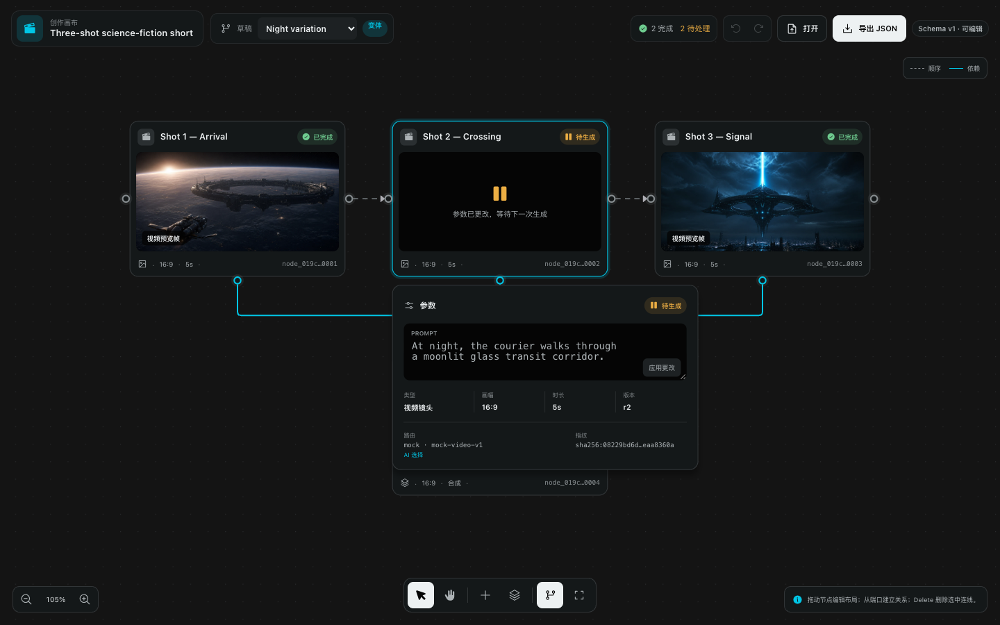
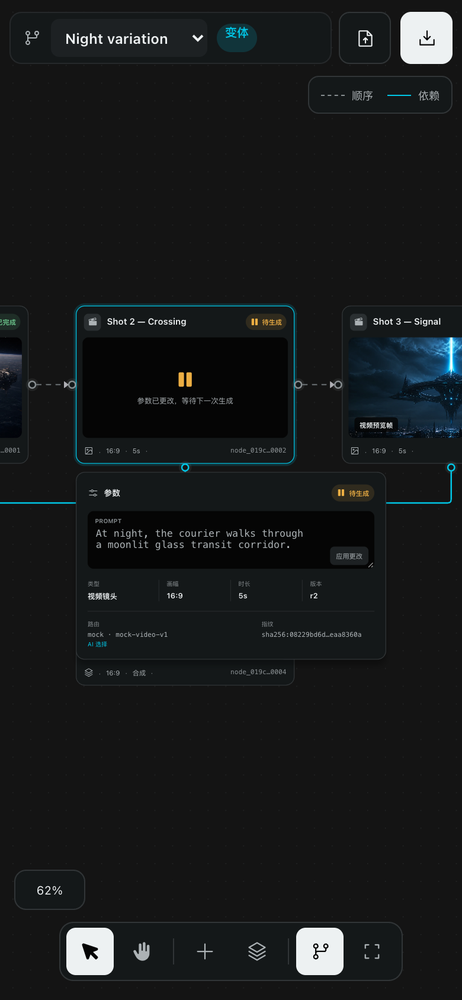

# React Flow editor QA

This folder records the visual QA baseline for the first editable-canvas slice.

- Desktop: 1440 × 900, full graph fitted with the selected node parameter panel open.
- Compact: 390 × 844 at 2× scale, selected node focused at an editable zoom level.
- Automated accessibility: zero WCAG 2 A/AA violations reported by axe-core; remaining contrast items require manual review because the nodes are transformed by the canvas viewport.
- Runtime: node drag, prompt edit, undo, add node, typed edge creation, pan, zoom, and fit-view exercised in Chromium. Core mutation tests cover validated edge deletion.

