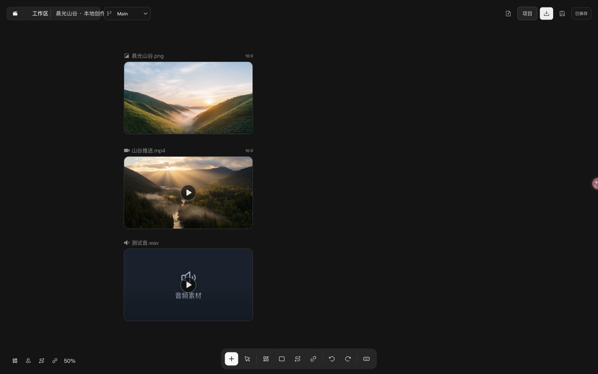
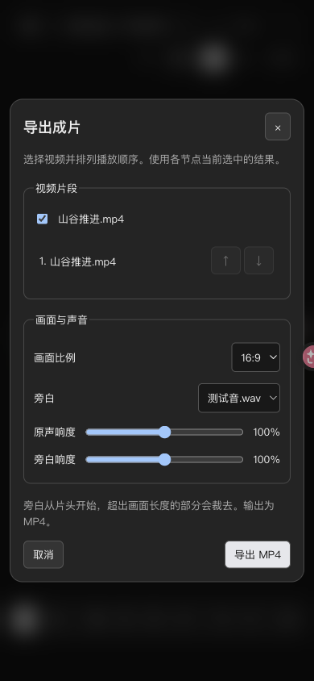
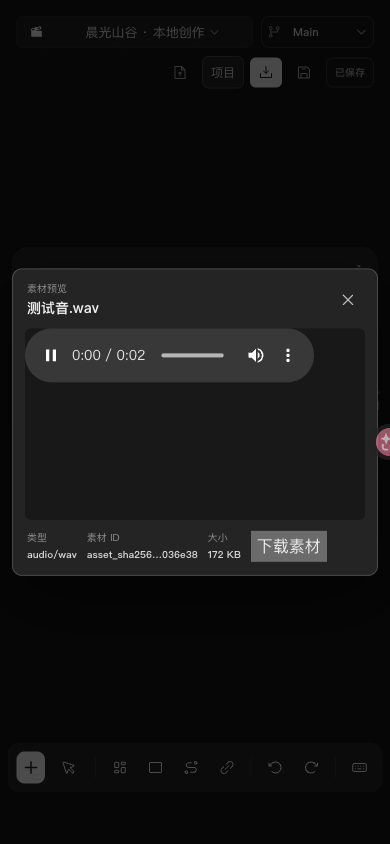

# Studio P0 验收 · 2026-09-30

本次交付把 Studio 随 CLI 分发，并补齐画布媒体导入、包含媒体的项目包、显式生成及基础 MP4 导出。项目 JSON 继续作为 CLI、Skill、Studio 的唯一数据来源；新增导出操作不增加画布节点类型。

## 结果

| 验收项 | 证据与状态 |
| --- | --- |
| 安装后打开 Studio | 临时目录安装 npm tarball，脱离源码运行；可读取 HTML、JS 和项目，未带令牌的项目请求被拒绝 |
| 新建、打开与保存 | `init --open` / `open` 使用包内 Studio；保存沿用 revision 检查及原子写入 |
| 真实图片生成 | 用户授权的 Ark 实例生成 PNG，2560×1440，3,905,385 字节，落入项目内容寻址目录 |
| 真实视频生成 | 同一 Ark 实例生成 H.264 视频，1280×720，4.042 秒，5,713,704 字节；首次调用退出后，新 CLI 进程继续查询原任务直至成功，视频任务数始终为 1 |
| 真实旁白生成 | **未完成**：当前 Speech 集成需要 OpenAI 凭证；已向用户索取本机私有 env 文件路径。没有把测试音频当作真实 TTS |
| 浏览器生成按钮 | 显式 mock 节点从待生成变为成功；单元测试验证先保存行内提示词，再提交生成。此项只验证浏览器调用链，不代表真实模型验收 |
| 素材导入 | 浏览器文件选择导入 WAV；浏览器文件 drop 事件导入 PNG，创建关联节点并持久化 |
| 完整项目转移 | 浏览器下载 `.ocanvas` 并通过“打开”恢复到新目录；恢复后 3 个节点可见，视频加载为可播放状态。测试逐字节验证素材恢复，并拒绝损坏、缺失、重复及越界条目 |
| MP4 成片 | 浏览器选择视频和本地测试音下载 MP4；FFprobe 确认 H.264、AAC、1280×720、4.055 秒。自动测试用红/蓝片段核对顺序，解码 PCM 确认混音非静音，并核对画面比例 |
| 窄屏 | 390×844 视口中页面宽度为 390，无横向溢出；保存按钮、导出窗口与音频播放均可触达 |

Ark 实测发现旧横竖屏图片预设像素数不足，提供方返回 HTTP 400。新预设改为 2560×1440 / 1440×2560，正方形仍为 2048×2048。旧文档保留原参数，不静默改写。

视频轮询遇到临时网络错误会保留任务句柄；尚未收到任务句柄的中断请求和同步语音请求不会静默重发。测试还覆盖生成结束时保留其他画布修改。

## 可复现检查

```sh
npm run check
npm test
npm run build
npm run test:package
node --test packages/preview/tests/sites-worker.test.mjs
git diff --check
```

本机 Node.js 24.18.0：Core 66、CLI 34、Studio 71，共 171 项源码测试通过；独立 npm 安装包测试及 4 项 Sites 兼容检查通过。打包测试安装时禁用 dependency scripts，仍可执行媒体探测与渲染。Vite 保留现有大 chunk 提示，不影响构建。

项目包只包含规范文档和已登记素材，不包含提供方配置、env 文件或本地服务令牌。截图中的图片和视频是本次授权生成结果的本地导入副本；“测试音.wav”是本地产生的 440 Hz 测试音。凭证、内部域名、账户、接入点及任务 ID 均未收录到本验收目录。

## 浏览器证据




| 窄屏成片导出 | 窄屏本地音频播放 |
| --- | --- |
|  |  |

## 当前边界

导出按所选节点的当前结果拼接视频，支持一段从片头开始的旁白。输出为 720p 级 H.264/AAC MP4，等比例补边；旁白超出画面长度的部分裁切。没有新增时间线编辑器、转场、字幕或音乐生成。单素材导入上限 256 MiB；完整项目媒体总量上限 4 GiB，浏览器恢复的压缩包上限 1 GiB。
